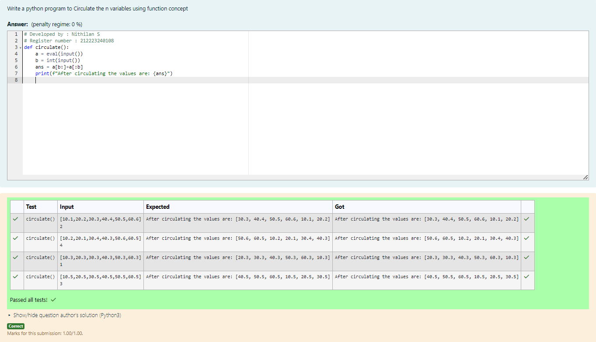

# Circulate-the-values-of-N-variables
## Aim:
To write a python program to circulate the n variables using function concept
## Equipment’s required:
PC
Anaconda - Python 3.7
## Algorithm: 
### Step 1: 
First step is to define from the user
### Step 2: 
Assign the value of variable to a temporary variable
### Step 3: 
Get the value from the user for the number of rotation
### Step 4: 
Using the slicing concept rotate the list
### Step 5: 
Print both the values it would be interchanged
### Step 6: 
End the program
## Program:
```python
def circulate():
    a = eval(input())
    b = int(input())
    ans = a[b:]+a[:b]
    print(f"After circulating the values are: {ans}")
```
## Output:

## Result:
Thus the program has been sucessfully executed
